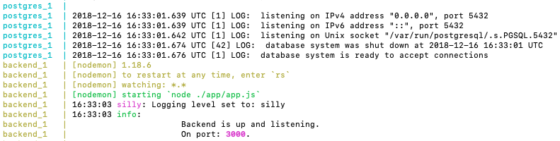
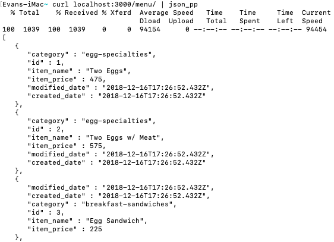

# Point of Sale System Backend
This backend provides a RESTful API to management the data needed by a restaurant's point of sale system. 

**Supports CRUD operations on the following persistent data:**
   - Menu items with prices. 
   - Menu categories to which any menu item may belong. 
   - Sales of menu items. Includes the total of the sale and the sales tax used to calculate it. 
   - Day summaries of all sales made in each day.

## Getting Started
Start here to set up a development environment for the PoS backend. 
### Install Docker and Docker-Compose
The first step is to install [Docker](https://www.docker.com/get-started) and [Docker Compose](https://docs.docker.com/compose/install/) on your OS. If you already have both installed and working, you can skip this step. 

If you are using a Mac and have the [brew package manager](https://brew.sh/), you can follow [this tutorial](https://pilsniak.com/how-to-install-docker-on-mac-os-using-brew/) to get docker working on your machine.
 
 To test if your set up is correct, try navigating to the parent directory of this repo and run `docker-compose build` followed by `docker-compose up` (for future runs, you should only have to build once). 
  
  If everything worked you should see a series of postgres status messages, then something like this
  
  
  If you receive an error message related to Docker, try to Google the error while specifying your OS. Using Mac, I ran into the [Couldn't connect to Docker daemon](https://github.com/docker/compose/issues/2180)  error, and then did a bit more troubleshooting after `docker-machine start default` didn't work. Don't lose heart, just keep Googling. After you set up Docker once, it shouldn't need additional tinkering. 
  
### Starting the backend
After successfully getting docker to work, build the backend image once by using `docker-compose build`, then you can run the backend at any time using `docker-compose up` or `npm start`. 

### Initializing the database
To initialize the database, run `npm run create_tables`. If you want to work with an empty database that is all you need to do. However, if you'd like to initialize the tables with data for testing your environment with, run `npm run populate_tables` to fill each table with the contents found in [templates.js](./app/config/templates.js). 

Feel free to edit the contents of [templates.js](./app/config/templates.js) as needed. Just make sure to enter data that is consistent with the PostgreSQL tables defined in [tables.js](./app/db/tables.js).  


### Interacting with the backend
You should now have the backend up and running. You can interact with the data by using the endpoints documented in the [API](#api) section of this document.  

If you are unfamiliar with how to interact with a RESTful API, see [Appendix A: Interacting with the API](#appendix-a-interacting-with-the-api) to learn how to inspect the API using `curl` or how to access it on a frontend using Javascript's `fetch(...)`.
  

# Reference

## API
The routes for the API can be found in [app/routes/index.js](./app/routes/index.js). The specific parameters after each route in [index.js](./app/routes/index.js) are imported from the JS files in the same directory. 

Terminology: 
- **Parameters or Params:** Will refer to the URI endpoints. For instance, to GET a specific menu item by it's ID, you would call `GET "/menu/:id"`, where `:id` is a numeric parameter referring to the specific menu item (i.e. `GET /menu/1`). In this case `:id` is a **param**
- **Body:** Will refer to the JSON contents passed to the endpoint. For instance, to POST a new menu item, you would call 
    ```
    POST "/menu", {
        item_name: "New item",
        item_price: 42,
        category: "beverages"
    }
    ```
    The data sent alongside the POST is the body. In this case, `item_name` belongs to the **body**.
    
In summary, `:id` belongs to the **params** and `item_name` belongs to the **body**. 


## Local Data Management 
These are scripts that help developers create, delete, and populate the backend's database to ease development. Each script can be found in the "scrips" key in [package.json](./package.json).  

#### Create Tables
 `npm run create_tables`

Creates each of the tables using the keys in [table_management.js](./app/db/table_management.js). The tables are created in order of dependencies. This means that the *menu_categories* table will be created before the *menu* table to account for the optional foreign key dependency of *menu_category* in each *menu* item.   

#### Remove Tables
 `npm run drop_tables`

Drops each of the tables using the keys in [table_management.js](./app/db/table_management.js). The tables are dropped in reverse order of dependencies.

#### Populate Tables
 `npm run populate_tables`

Populates already-created tables with the data found in [templates.js](./app/config/templates.js). Each top-level key in templates.js must match the table name, and the objects in each of the top-level key's arrays must be consistent with the data expected in each table, as described in [tables.js](./app/db/tables.js). 

**Note:** The templates in the [/app/config/templates.js](./app/config/templates.js) file are separate from the templates used for testing in the [/test/test_templates.js](./test/test_templates.js) file. If you wish to modify the templates in the development environment, modify [/app/config/templates.js](./app/config/templates.js) instead of the test templates. 

# Appendix
This appendix contains written tutorials and other helpful links/resources.

## Appendix A: Interacting with a RESTful API
Interacting with the API involves sending *(POST)* and receiving *(GET)* JSON documents through specific parameters (URLs/URIs).

There are four HTTP methods that each map to a CRUD (Create, Read, Update, Delete) operation. 
- POST: Create
- GET: Read
- PUT: Update
- DELETE: Delete

When you perform an HTTP method, you will call it on a *route/endpoint/URL*.

For example, you can call **GET** on **localhost:3000/menu/1** to *get* the first menu item. Notice that for a GET request you don't pass any data. 

If you were to send a **POST** on **localhost:3000/menu** you would send a body or data parameters. In JSON that could look like the following object: 
```json
 {
    "item_name": "Two Eggs",
    "item_price": 475,
    "category": "egg-specialties"
 }
```
and a new menu item would be created using the data you sent.

To verify that your item was created, a **HTTP Status** response will be sent to you. If created successfully your `response.status` would be `201`. If you entered invalid data, for instance `item_price: "a string"`, you would receive a `400` status code. 

To see a full list of status codes, visit [https://httpstatuses.com/](https://httpstatuses.com/), a site I'd recommend adding to your bookmarks. 

Some responses (such as GET) return contents in addition to an HTTP status. For instance, a **GET** call to **localhost:3000/sales** would return an array of all says made in the current day. Parsing that array into JSON or an array object is language specific. 

### Implementing the Interactions
Here we will cover how you can interact with an API from the command line using `curl` (to quickly test out an endpoint), and how to fetch/send data using the `fetch` command in Javascript. 

#### Using `curl`

**Note:** Curl is only available on Linux/Mac by default.

**Note 2:** For these examples to work properly, make sure you've run `npm populate_tables` after creating the tables, to insure that you have data to actually fetch in each command.  


By default, you can simply perform a get request with curl as follows:
 - `curl localhost:3000/menu`
 
To make the output of the JSON more readable, you can pipe the output to `json_pp`
 - `curl localhost:3000/menu | json_pp`
 
 You should get something like this: 
 
 
 
 You can also send other types of HTTP methods, like POST. In this example we will create a new menu item.
 - `curl localhost:3000/menu -X POST -H "Content-Type: application/json" -d '{"item_name": "New item", "item_price": 42, "category": "beverages"}'`
 
 If created successfully, it should return the newly created item. 
 
 You can double check by calling `curl localhost:3000/menu | json_pp` again, and you should see the "New item" listed. 
 
 For a GUI environment with many more features, look into [Postman](https://www.getpostman.com/) for developing/naive testing the API. 
 
 #### Using `fetch`
 Despise the name, fetch can be used to implement any HTTP method (GET, POST, PUT, DELETE, etc). 
 
 For official documentation for using fetch, see [Mozilla's Using Fetch](https://developer.mozilla.org/en-US/docs/Web/API/Fetch_API/Using_Fetch).
 
 This section will just include a quick bootstrapped examples to get you started with fetch. 
  
  
  
**Fetching menu items using async await (preferred method)**
```javascript
 // Can only "await" from async function
 async function main() {
   console.log(await fetchMenuItems());
 }
 
 async function fetchMenuItems(){
         const response = await fetch('http://localhost:3000/menu');
         // response.json must be awaited 
         return JSON.stringify(await response.json());
 }
 
 main();
```

**Fetching menu items using promises**
```javascript
 function fetchMenuItems(){
        return fetch('http://localhost:3000/menu')
            .then(function(response) {
                return response.json();
            })
            .then(function(myJson) {
                return JSON.stringify(myJson);
            });
    }
    
  // Promise "awaits" until finish before passing results to .then
 fetchMenuItems().then((results) => {
     console.log(results)
 });
```
 
 **Posting a new menu item using async await**
```javascript
(async () => {
    // Call the postObject method located below. Specify the endpoint: /menu
    const response = await postObject("/menu",  {
       item_name: "New item 2",
       item_price: 666,
       category: "egg-specialties"
    }, {
        // Options for the postObject function
        return_response: true,
        log_results: true
    });
    
    if (response.status === 200) {
        let user_response = await response.text();
        // If JSON, parse
        if (user_response[0] === "{") {
            user_response = JSON.parse(user_response);
        }
        
        console.log(user_response);
    } else {
        console.error("Error creating a new menu item");
    }
})();

// Put this function somewhere and export it since you will likely use it for all POSTs
async function postObject(uri, send_object, options) {
    const response = await fetch("http://localhost:3000" + uri, {
                        // Specify the method (Could replace with PUT, POST, or DELETE)
                        method: "POST",
                        // Tell the server you are sending a JSON object
                        headers: {
                            'Accept': 'application/json',
                            'Content-Type': 'application/json',
                            'Cache': 'no-cache'
                        },
                        // Body sent in HTTP method must be converted into a String. It will be parsed back into a JSON object by server
                        body: JSON.stringify(send_object),
                    });

    options.log_results && console.log(response.ok ? "Successful response!" : "Failed response");

    // Response will be returned if return_response is set to true
    if (options.return_response) {
        return response;
    }
}
```
 